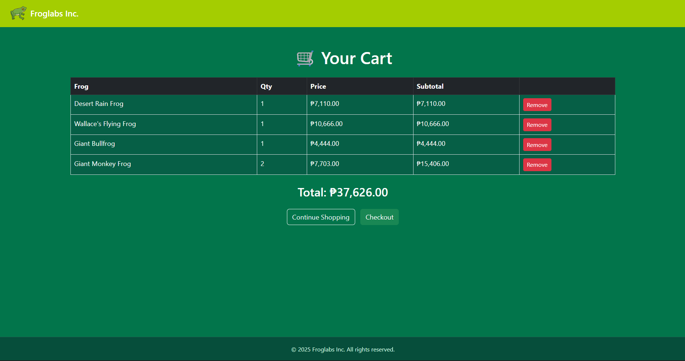

# 🐸 Froglabs Inc.

**Froglabs Inc.** is a dynamic e-commerce web application developed as a school project to showcase core web development concepts such as frontend UI design, backend logic, authentication, and cart/checkout functionality.

The project features a playful frog-themed interface with support for **light and dark modes**, a fully functional product catalog, and a simulated checkout process that demonstrates end-to-end user flow.

---

## ✨ Features

- 🛒 Product listings with dynamic pricing and sale indicators  
- ➕ Add-to-cart functionality with cart quantity tracking  
- 🔐 Session-based login and signup system  
- 🌗 Light and dark mode toggle  
- 💳 Checkout flow with order placement and confirmation animation  
- 📦 Backend logic for cart and checkout processing  
- 🎨 Clean, responsive UI with a consistent color palette  

---

## 🖼️ Preview

### Homepage (Light Mode)

### Homepage (Dark Mode)

### Signup & Login

### Cart

### Checkout – Place Order

### Checkout - Order Successful

Screenshots showcasing the following features will be added:

- Homepage (Light Mode)  
- Homepage (Dark Mode)  
- Signup and Login  
- Cart  
- Checkout – Place Order  
- Checkout – Success Screen  

---

## 🛠️ Tech Stack

- **Frontend:** HTML, CSS, JavaScript  
- **Backend:** PHP  
- **Database:** MySQL  
- **Server:** Local PHP server (XAMPP or similar)

--- 

## 🚀 How to Run Locally 

1. Install a local PHP server (e.g. **XAMPP**)
2. Place the project folder inside the server's htdocs directory 
3. Import the database (if applicable)
4. Start Apache & MySQL
5. Open in browser: localhost/Ecommerce/froglabs.php

---

## 👤 Author

**Jose Victor Siong**  
BS Information Technology Student  

- GitHub: https://github.com/Lemon-frog
- Project: Froglabs Inc.
